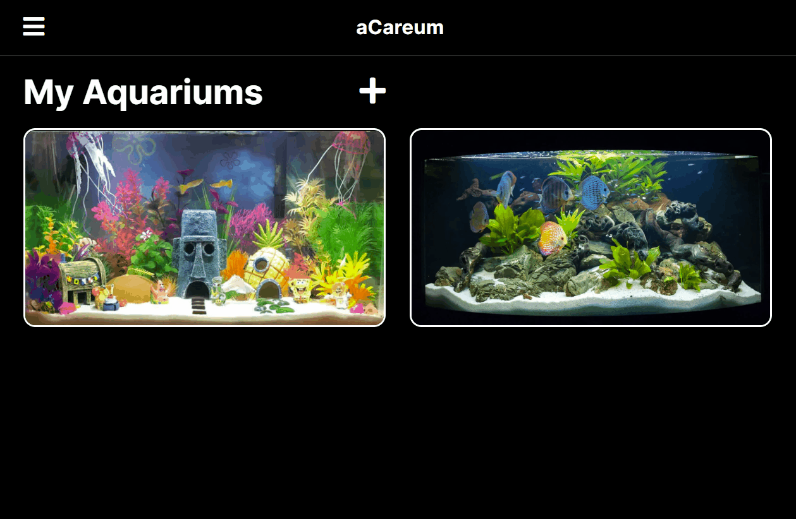
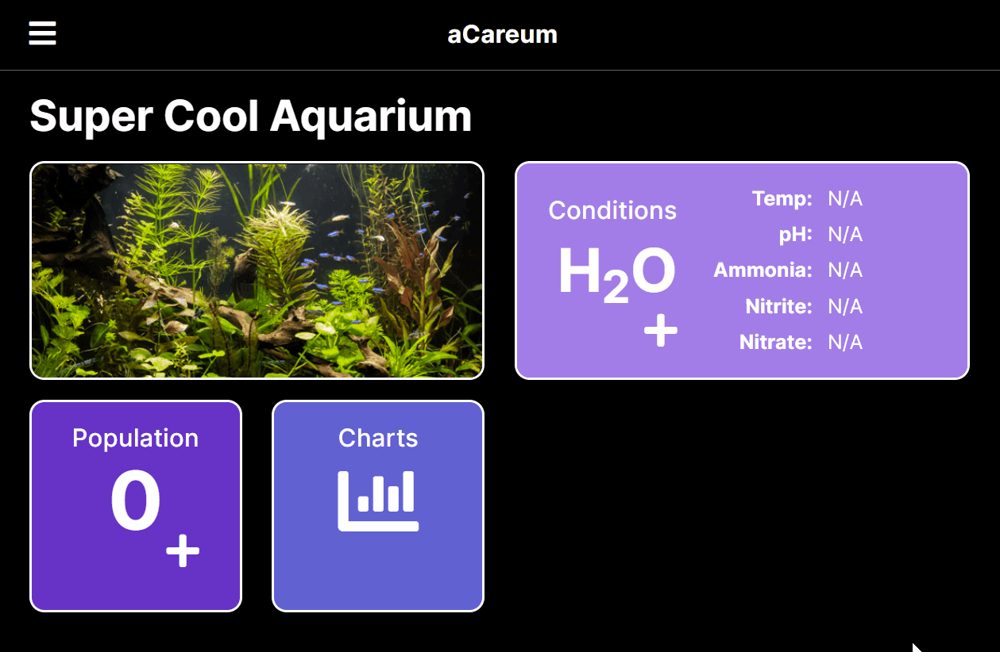
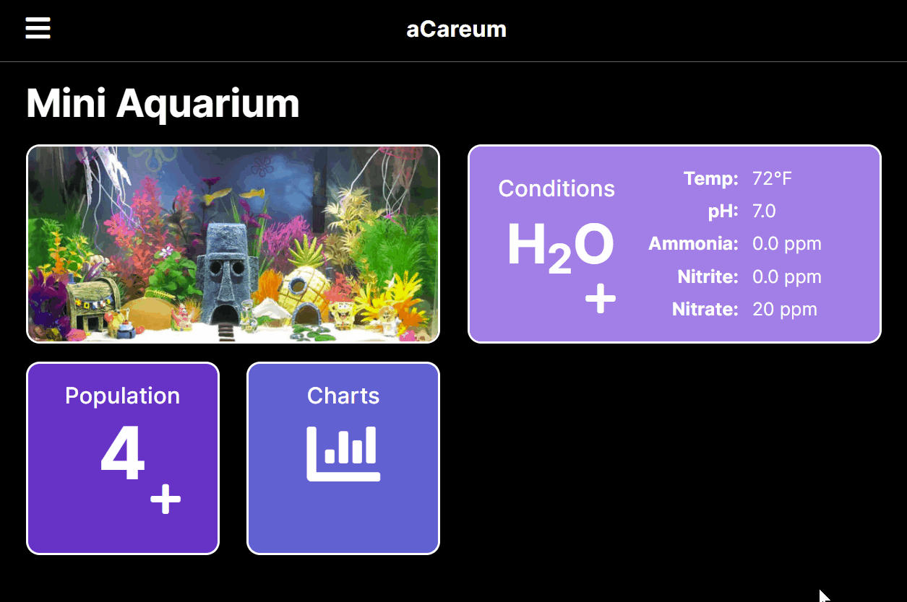

# aCareum

A full stack JavaScript application for aquarium hobbyists who want to manage their personal aquariums.

aCareum was created for those who enjoy keeping track of their aquarium conditions and inhabitants. Aquariums have sensitive environments and hobbyists need a way to make sure their tanks are in top condition. aCareum allows users to have a dedicated dashboard for each of their aquarium tanks so management is streamlined.
## Technologies Used

- React.js
- Webpack
- Bootstrap 5
- Node.js
- PostgreSQL
- Express
- JavaScript (ES6)
- HTML5
- CSS3
- Heroku

## Live Demo

Try the application live at [https://acareum.herokuapp.com/](https://acareum.herokuapp.com/)

## Features

- Hobbyist can add an aquarium tank.
- Hobbyist can view their aquarium tanks.
- Hobbyist can add an aquarium inhabitant within a tank.
- Hobbyist can view information on the inhabitant.
- Hobbyist can remove the aquarium inhabitant.
- Hobbyist can add aquarium water conditions.
- Hobbyist can view a chart of specific aquarium condition over a time span (7 days or 30 days)

## Stretch Features

- Hobbyist can set up reminders on when to feed fish and clean tank
- Hobbyist can indicate which inhabitant requires special attention (sick, spawning, treated)
- Hobbyist can move the inhabitant to another aquarium
## Preview





## Development

### System Requirements

- Node.js 10 or higher
- NPM 6 or higher
- PostgreSQL 12.9 or higher

### Getting Started

1. Clone the repository.

    ```shell
    git clone git@github.com:ellie-hwang/acareum.git
    cd acareum
    ```

1. Install all dependencies with NPM.

    ```shell
    npm install
    ```

1. Make a copy of the .env.example file and name it .env

    ```shell
    cp .env.example .env
    ```

1. Set up your environment variables such as a database_url, aws_access_key_id, aws_secret_access_key, and aws_s3_bucket in the .env file

1. Import the example database.

    ```shell
    npm run db:import
    ```

1. Start the postgres database server with the following command.

    ```shell
    sudo service postgresql start
    ```

1. On a separate terminal, launch the pgweb PostgreSQL database client with the following command.

    ```shell
    pgweb --db=acareum
    ```

1. View the database by opening http://localhost:8081 on your default browser.

1. Start the project. Once started you can view the application by opening http://localhost:3000 in your browser.

    ```shell
    npm run dev
    ```

1. Make sure to exit the postgres database server with the following command once you have finished your application session.

    ```shell
    sudo service postgresql stop
    ```
